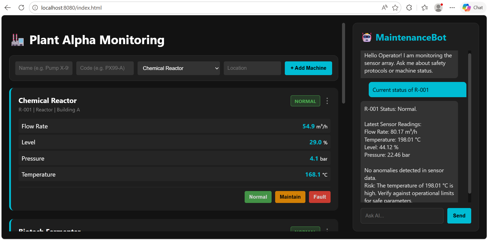

# 🛰️ PRISM | Real-Time Monitoring & AI Diagnostics System
> **AI-powered observability for fast-moving operations. Track live machine health, detect anomalies early, and dispatch alerts across email, SMS, and voice before issues escalate.**


## Overview

PRISM is a Spring Boot monitoring and diagnostics system that tracks machine sensor data, detects anomalies, and sends alerts through email, SMS, and voice.

## UI Preview

<p align="center">
  
</p>

## Key Features

- 🔴 Live monitoring dashboard for real-time machine metrics such as load, latency, and errors
- 🤖 Gemini AI-assisted diagnostics to analyze logs and surface probable root causes
- 📈 Threshold detection to trigger alerts when sensor values cross defined limits
- 🧊 Flatline detection to identify frozen or unresponsive sensors
- 📧 Email alerts powered by JavaMail
- 📲 SMS notifications through Twilio
- 📞 Voice call escalation for critical incidents
- ⚡ Fast incident response designed to reduce MTTD

## How It Works

```text
Metric Collection
    -> Sensor readings are generated or ingested for each machine
    -> readings are stored and refreshed in near real time

AI Diagnostics
    -> monitored values are analyzed for threshold breaches, trend shifts, and frozen signals
    -> Gemini AI reviews logs and highlights likely root causes

Alert Dispatch
    -> critical events are converted into alerts
    -> notifications are sent through Email, SMS, and Voice Call channels
```

## System Components

### 1) Monitoring Engine

The Monitoring Engine is the core observability layer. It:

- Collects and stores machine sensor readings
- Refreshes live readings for the dashboard
- Tracks historical values for anomaly detection
- Applies simple predictive logic using trend analysis and z-score checks

In this project, the monitoring flow is intentionally built like a real operations tool: the system does not only display numbers, it interprets them.

### 2) AI Diagnostics

The AI Diagnostics layer adds intelligence on top of raw sensor data.

- Gemini AI analyzes logs and operational patterns
- Probable root causes are surfaced for faster triage
- The diagnostics layer supports operator decision-making instead of replacing it

This is the part that makes the system feel less like a dashboard and more like a support assistant for incident response.

### 3) Alert System

The Alert System is responsible for escalating issues fast and reliably.

- Sends emails through JavaMail
- Sends SMS alerts through Twilio
- Initiates voice calls for severe incidents
- Persists alert records for traceability

This multi-channel approach is ideal for high-priority environments where a single notification path is not enough.

## Threshold and Flatline Detection

### Threshold Detection

Each sensor has an expected operating range. When a reading rises above the configured maximum, the system marks it as abnormal and can trigger escalation.

In simple terms:

- Normal value = within range
- Threshold breach = above the safe operating limit
- Result = anomaly flag and possible alert

### Flatline Detection

Flatline detection watches for repeated identical readings over time.

If a sensor keeps returning the same value for several cycles, the system treats it as a likely frozen signal or sensor failure.

In simple terms:

- Value changes normally = sensor is alive
- Value repeats too many times = signal may be stuck
- Result = frozen-sensor alert

## Tech Stack

- **Frontend:** HTML5, CSS3, JavaScript
- **Backend:** Java 21, Spring Boot 3.5.9
- **Data Layer:** Spring Data JPA, H2 in-memory database
- **AI Integration:** Google Gemini AI
- **Email Alerts:** JavaMail / Spring Mail
- **SMS & Voice Alerts:** Twilio API
- **Build Tool:** Maven
- **API Testing:** Postman
- **Utilities:** Lombok, MapStruct

## Key Integrations

### Gemini AI

Gemini AI adds a diagnostics layer for log understanding and issue classification. It helps transform raw operational data into human-readable insights, which is especially useful during incident triage.

### Twilio

Twilio powers two critical escalation channels:

- SMS for immediate mobile notification
- Voice calls for urgent, high-severity incidents

This makes the alerting pipeline more resilient than email-only monitoring.

### JavaMail

JavaMail handles email-based incident alerts. It is useful for structured incident summaries, post-event visibility, and primary alert distribution to operations teams.

## API Endpoints Overview

| Method | Endpoint | Description | Key Params |
|---|---|---|---|
| `GET` | `/api/machines` | Returns machines with optional pagination and sorting | `page`, `size`, `orderBy`, `orderAs`, `fetchAll` |
| `POST` | `/api/machines` | Adds a new machine to the monitoring system | Machine JSON body |
| `GET` | `/api/machines/{id}/latest` | Fetches the latest readings and machine snapshot | `id` |
| `POST` | `/api/machines/{id}/status` | Updates machine status to influence monitoring behavior | `id`, `status` |

Example:

```bash
GET /api/machines?fetchAll=true
GET /api/machines/1/latest
POST /api/machines/1/status?status=sabotage
```

## Installation & Setup

### Prerequisites

- Java 21
- Maven or the included Maven Wrapper
- A Gmail account with an app password for email alerts
- Twilio account SID, auth token, and phone numbers
- Gemini API key if you want to enable AI diagnostics

### Clone the repository

```bash
git clone <your-repo-url>
```

### Configure application properties

Update `src/main/resources/application.properties` with your environment values.

```properties
spring.mail.username=YOUR_EMAIL@gmail.com
spring.mail.password=YOUR_APP_PASSWORD

twilio.account.sid=YOUR_TWILIO_ACCOUNT_SID
twilio.auth.token=YOUR_TWILIO_AUTH_TOKEN
twilio.phone.number=YOUR_TWILIO_NUMBER
emergency.contact.number=YOUR_DESTINATION_NUMBER

gemini.api.key=YOUR_GEMINI_API_KEY
```

### Open the application

- Dashboard: `http://localhost:8080`
- H2 Console: `http://localhost:8080/h2-console`

### Test the API

Use Postman to verify:

- Machine creation
- Live machine polling
- Latest sensor data retrieval
- Status updates that simulate normal, maintenance, or fault states

## What I Built & Learned

As a Java Developer Intern, I built this project to practice the kind of engineering that matters in real operations environments.

I learned how to:

- Design for observability instead of just data display
- Combine monitoring rules with AI-driven diagnostics
- Build alerting systems that work across multiple channels
- Think in terms of incident response, escalation, and operator experience
- Structure a backend system that feels closer to a production SRE tool than a classroom demo

This project strengthened my ability to work on backend systems that are practical, resilient, and business-relevant.

## Project Value

PRISM demonstrates more than just CRUD or dashboard work. It shows backend engineering depth in:

- Real-time sensor data handling
- Anomaly detection logic
- Predictive incident signaling
- AI-assisted troubleshooting
- Automated escalation workflows
